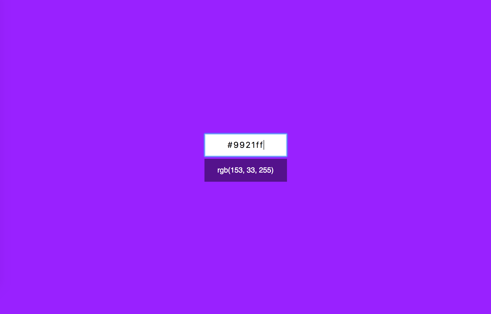

Конвертер цветов из HEX в RGB
===

Вам необходимо разработать конвертер цветов из HEX в RGB.

## Интерфейс конвертера

При правильном вводе цвета он показывает его представление в формате RGB и меняет цвет фона на заданный:

Конвертер при вводе неправильного цвета в формате HEX должен сообщать об ошибке:

Необходимо дожидаться ввода всех семи символов, включая решётку, чтобы принимать решение о том, показывать ошибку или менять цвет фона.
